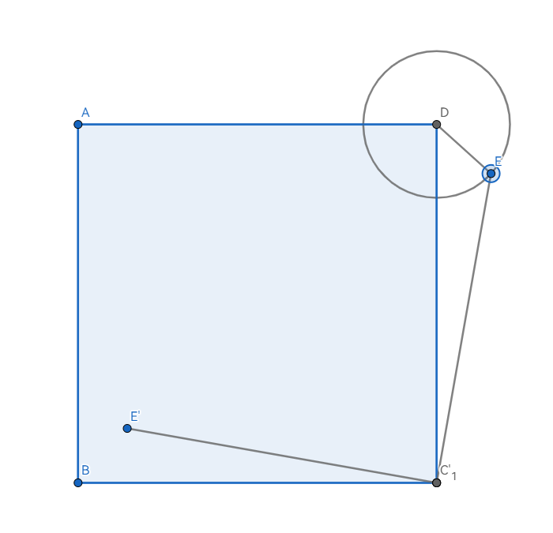
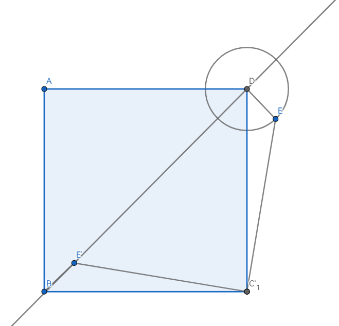
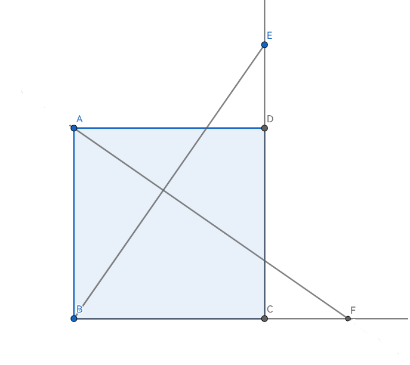
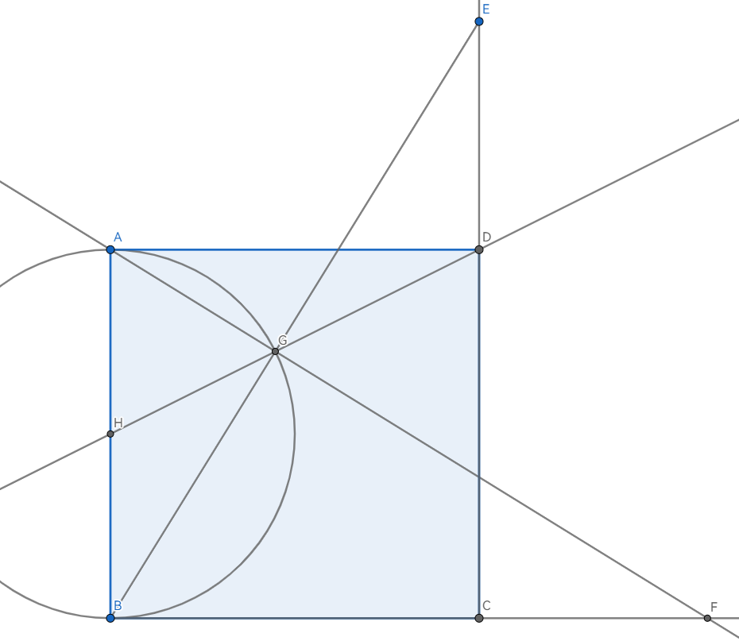

# 最值归纳
  

</img></img></img></img>

## 将军饮马 

|类别|例题|突破点/解法|
|-|-|-|
|  最小值| | 原理：A',B,C三点共线， 此时 $A'B={(AC+BC)}_{min}$ |
|最大值|2023 恒基模拟（七）23(3)|以 **$x$轴** 为对称轴作B对称点B'，连接AB'， 易知 $AB:y=-\frac{3}{10}x+\frac{17}{5}$ ， 与 $x$轴 交于 $P(\frac{34}{3},0)$
|     ||

##  使用“顶点式”确认最值

|方法|例题|突破点/解法|
|-|-|-|
|使用“顶点式”|2023 恒基模拟（八）@23(2)|设 $P(x^2,-x^2+3x+4 )$ ，连立 $l:y=-x-1$ 易知 $PE=PF=-x^2+4x+5$ ，求出顶点即可|

## 使用三角形三边规律
|方法|例题|突破点/解法|
|-|-|-|
|两边之和大于第三边|2023 恒基模拟（七）24(3)|易知 $C_{△PMN}=3PN=\frac{3}{2}BD$ ， 则 $C_{△PMN(max)}=\frac{3}{2}$ BD $_{max}$   $=\frac{3}{2}(AD+AB)$

## 轨迹圆问题

|类别|例题|突破点/解法|
|-|-|-|
|圆外一点到圆上距离的最值|已知正方形ABCD，AB=3， ⊙A半径为1，E是⊙A上的任意一点， 将DE绕D逆时针旋转90°得到DE'， 连接AE'，则AE'的最值是多少？ |全等求得AE=CF=1后， 易知E'绕使B做圆周运动， 此时使A,F,C三点共线 |
|隐圆|已知正方形ABCD， E、F为动点且 **DE=CF** ， AF与BE交于G，求GD最小值|∠AGB=90°， 则G绕AB中点做圆周运动 

## 瓜豆问题

|类别|例题|突破点/解法|
|-|-|-|
|全等证长度相等/定值|2023 恒基模拟（二）|作GR⊥BC，三垂直模型证全等后可知 **GR=CE=5** ，然后使用 **将军饮马** 作出最小值|
|全等证明角度、轨迹相等|[2023 市北二模24(3)](https://www.jyeoo.com/math/ques/detail/4d24102e-2151-4150-853a-670daaf25d70?so=4&yr=2023&rg=1080200)|易证**△ADR≌△CDQ**，易知 **OR⊥AR** 时OR最小，后续使用三角函数即可求解|

##  胡不归

> 难度极大，参考以下文章：

- [初中几何模型胡不归最值模型 - 副本.doc](https://laobanzhang0-my.sharepoint.com/:w:/g/personal/laobanzhang_laobanzhang0_onmicrosoft_com/ERKd-4od5spLmYrNmwA3QoYB0Iovi4nKT3vIJO0-3Cd-IA?e=pvyvW4)

- [胡不归问题全解，乌鸦坐飞机，折射原理，光行最速？](https://mp.weixin.qq.com/s/Nho6n-vb-uak74wUDMTcaQ)

· —— 以下为增补区 —— ·

                          

· —— 不要靠近这里，因为再近一点靠近一点快被融化 —— ·

